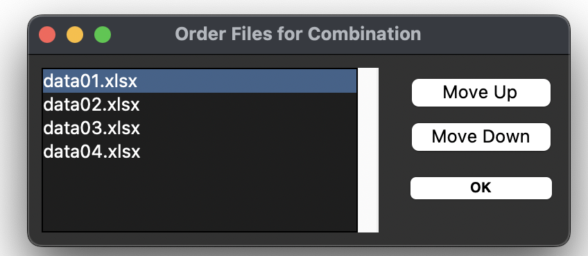
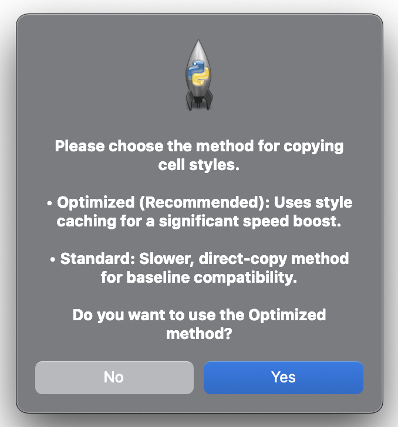
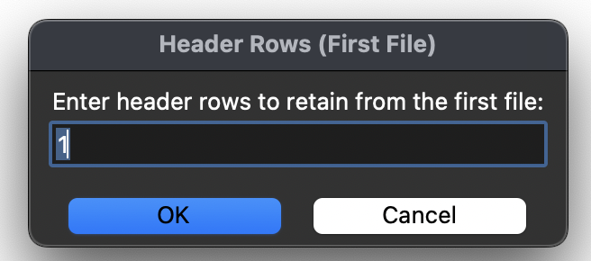
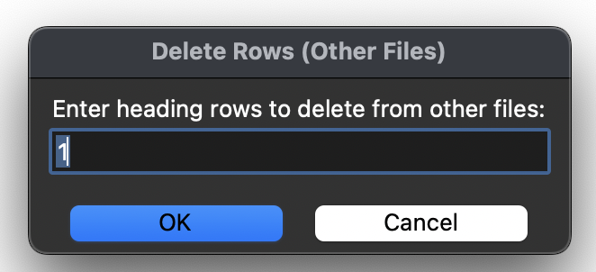
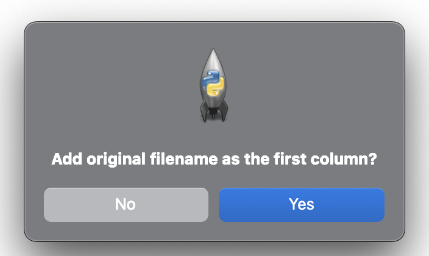
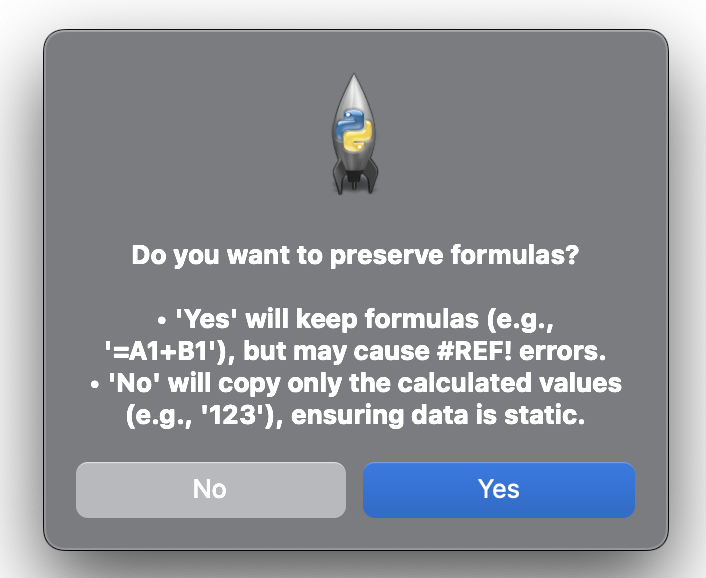
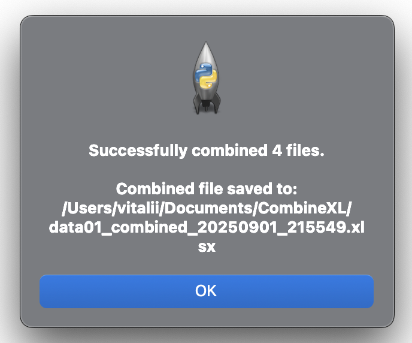

# CombineXL

A GUI-based utility for combining multiple Excel files (.xlsx) into a single, master workbook. The tool is designed for performance and usability, featuring a responsive, non-blocking interface that preserves all cell formatting, styles, and merged regions 📊🔗


<p align="center">  </p>

**➡️ Read more about the project, its features, and development in my [Medium story.](https://medium.com/@starosta/combine-excel-files-with-python-c42005cf34c1)** 


## Table of Contents

- [Overview](#overview)
- [Key Features](#key-features)
- [Installation](#installation)
- [Usage](#usage)
- [Project Structure](#project-structure)
- [Development](#development)
- [Known Issues](#known-issues)
- [Contributing](#contributing)
- [License](#license)
- [Contact](#contact)

## Overview

CombineXL tackles the tedious task of manually merging data from multiple Excel spreadsheets. This tool provides an intuitive graphical interface to seamlessly combine any number of .xlsx files into one master file, giving you full control over the process.

The core strength of CombineXL is its meticulous preservation of the original files' integrity. It copies not just the data but also all cell formatting, styles, comments, merged cell ranges, and column/row dimensions. The entire operation runs in a background thread, ensuring the application never freezes, and you can monitor its progress or cancel it at any time.

A typical workflow involves:
1.	Launching the script and selecting the Excel files to combine.
2.	Interactively reordering the files to control the sequence of combination.
3.	Choosing an output location and filename.
4.	Selecting between an Optimized (fast) or Standard processing method.
5.	Configuring combination parameters: header rows to keep from the first file, header rows to discard from subsequent files, and whether to add a source filename column.
6.	Deciding whether to keep formulas or convert them to static values.
7.	Monitoring the non-blocking progress window.
8.	Receiving a summary report upon completion, cancellation, or error.


## Key Features

-   **Optimized Processing Engine:** Features a high-performance mode that uses style caching to dramatically speed up the combination process on files with extensive formatting.
-   **Interactive File Ordering:** A unique dialog allows you to drag and drop or move files up and down to define the exact order of combination.
-   **Rich Formatting Preservation:** Faithfully copies fonts, colors, borders, fills, number formats, and alignments.
-   **Non-Blocking GUI:** The combination process runs in a separate thread, keeping the UI fully responsive.
-   **Real-Time Progress Tracking:** A dedicated window shows the current status, a progress bar, and which file is being processed.
-   **Graceful Cancellation:** A "Cancel" button allows the user to stop the process at any point, preventing an incomplete output file.
-   **Formula or Value Preservation:** Users can choose to either keep formulas intact or save only their calculated static values to ensure data integrity.
-   **Flexible Header Control:** Specify how many header rows to retain from the first file and how many to discard from all subsequent files.
-   **Source File Tracking:** Optionally adds a new column at the beginning of the master file indicating the source filename for each row.
-   **Comprehensive Metadata Copying:** Preserves column widths, row heights, and merged cells from the source files.


## Installation

### Prerequisites

-   Python 3.6+
-   A graphical desktop environment is required to run the `tkinter`-based GUI.

### Clone the Repository

```bash
git clone https://github.com/sztaroszta/CombineXL.git
cd CombineXL 
```

### Install Dependencies

You can install the required dependency using pip:

```bash
pip install -r requirements.txt
```

*Alternatively, install the dependency manually:*

```bash
pip install openpyxl
```

## Usage

**1. Run the application:**

```bash
python excel_combiner.py
```

**2. Follow the GUI Prompts:**
*   **Select Input File:** A dialog will ask you to choose the .xlsx files you want to combine. You can select multiple files.
*   **Order Files:** A unique dialog appears where you can reorder the selected files. The final combination will follow this sequence.
<p align="center">  </p>


*   **Choose Processing Method:** You will be prompted to select between an "Optimized" (recommended for speed) and "Standard" cell copying method.
<p align="center">  </p>

*   **Select Output File:** Choose a folder and a name for the final combined .xlsx file.
*   **Configure Headers:** Enter the number of header rows to keep from the first file and the number of header rows to discard from the others.
<p align="center">  </p>
<p align="center">  </p>

*   **Include Filename:** A dialog will ask if you want to add a new first column containing the original filename for each row.
    <p align="center">  </p>

*   **Preserve Formulas:** A dialog box will ask if you want to keep formulas or save their calculated values. Choosing 'No' is safer for preventing broken references.
    <p align="center">  </p>
**3.  Monitor Progress:**
*   A progress window will appear, showing the current status and a progress bar. You can click "Cancel" at any time to halt the operation.
    <p align="center">  </p>
**4.  Verify Success:**
*   Upon completion, a summary dialog will report the outcome (success, cancellation, or error). The combined file will be located in your chosen output directory.
    <p align="center">  </p>    

## Project Structure

```
CombineXL/
├── excel_combiner.py       # Main script for running the tool
├── README.md               # Project documentation
├── requirements.txt        # List of dependencies
├── .gitignore              # Git ignore file for Python projects
├── assets/                 # Contains screenshots of the application's UI
└── LICENSE                 # GNU AGPLv3 License File
```

## Development

**Guidelines for contributors:**

If you wish to contribute or enhance CombineXL:
-   **Coding Guidelines:** Follow Python best practices (PEP 8). Use meaningful variable names and add clear comments or docstrings.
-   **Testing:** Before submitting changes, please test them locally by running the script with various Excel files to ensure existing functionality is not broken.
-   **Issues/Pull Requests:** Please open an issue or submit a pull request on GitHub for enhancements or bug fixes.

## Known Issues

-   **Formula References:** If you choose to preserve formulas, any formulas that reference cells in other workbooks or worksheets that are not part of the combination will result in #REF! or other errors. 
-   **Structural Mismatches:** Combining files with vastly different column structures may lead to data that is difficult to analyze in the final sheet. The optional "Include Filename" feature can help identify the source of each row.
-   **Platform Dependency:** The script requires a desktop environment with a graphical display to run, as it is built with tkinter. It will not run in a headless environment (like a standard server SSH session).

## Contributing

**Contributions are welcome!** Please follow these steps:

1.  Fork the repository.
2.  Create a new branch for your feature or fix.
3.  Commit your changes with descriptive messages.
4.  Push to your fork and submit a pull request.

For major changes, please open an issue first to discuss the proposed changes.

## License

Distributed under the GNU Affero General Public License v3 (AGPLv3) License.
See [LICENSE](LICENSE) for full details.


## Contact

For questions, feedback, or support, please open an issue on the [GitHub repository](https://github.com/sztaroszta/CombineXL/issues) or contact me directly: 

[](https://www.linkedin.com/in/vitalii-starosta)
[](https://github.com/sztaroszta)
[](https://gitlab.com/sztaroszta)
[](https://bitbucket.org/sztaroszta/workspace/overview)
[](https://gitea.com/starosta) 

Project Showcase: [sztaroszta.github.io](https://sztaroszta.github.io)

```
Combine smarter, not harder!
```

**Version:** 4  
**Concept Date:** 2024-05-22 

<p align="left"> </p>
